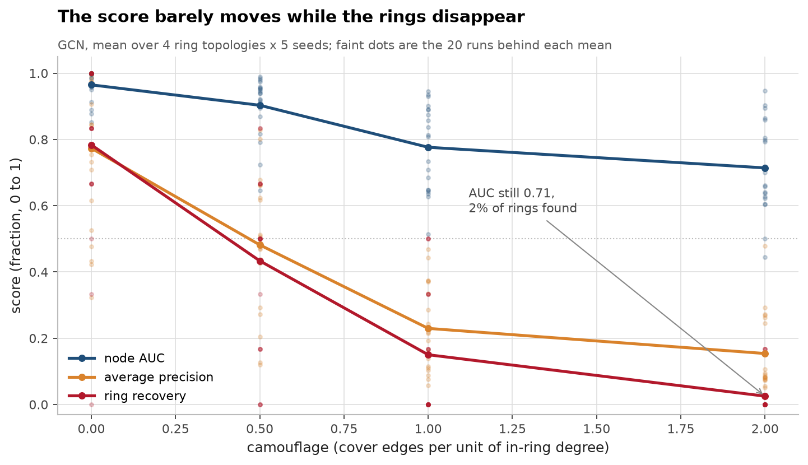
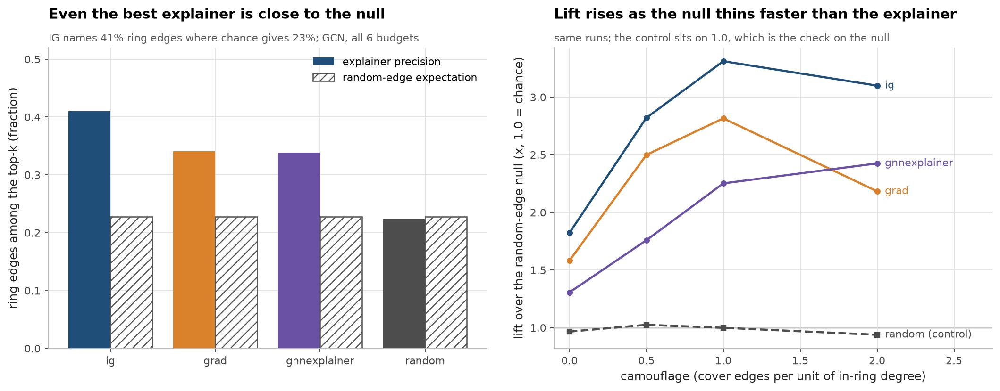
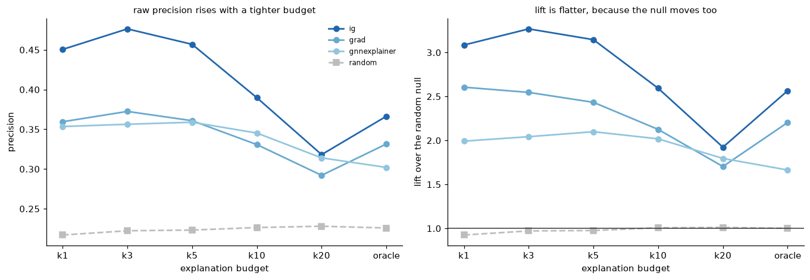
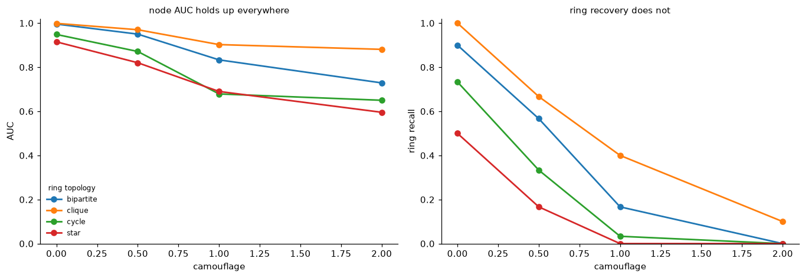
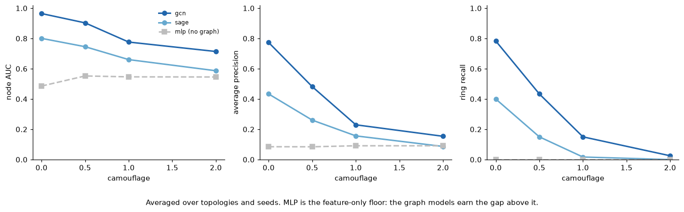

# RingFaith: methods and full results

The long-form sections of the report, moved out of the README so that file can
stay a front door. The text is unchanged from the version that lived in the
README; the only edit is that figure paths point up one directory.

## Abstract

Fraud-detection GNNs are reported by node-level AUC. An investigator does not act
on a score, though, they act on the explained structure, the handful of edges an
explainer says mattered. This work measures how far those two things drift apart,
separating three quantities that are usually conflated: node detection (AUC and
average precision), ring recovery (was the planted collusion ring surfaced at
all), and explanation faithfulness (do the explainer's top edges recover the
ring's own edges). The first two are prior art; the third is the contribution,
together with the random-edge null that any faithfulness number has to be read
against.

Across 80 configurations, 4 ring topologies x 4 camouflage levels x 5 seeds, 240
trained models, 4 explainers, 6 budgets, 131,136 faithfulness measurements, the
headline metric and the useful one come apart sharply. At camouflage 2.0 a GCN
still scores 0.71 AUC, which reads as a working model, while ring recovery has
fallen from 78% to 2%. Explanation faithfulness never gets far off the floor:
Integrated Gradients, the best of the four, puts 41% of its top edges inside the
ring against a 23% random-edge expectation. Lift over that null *rises* with
camouflage, at a rate that differs by explainer. GNNExplainer goes from 1.3x at
camouflage 0 to 2.4x at camouflage 2.0. Integrated Gradients goes from 1.8x to 3.1x,
with its peak of 3.3x at camouflage 1.0. The null thins faster than the explainer
degrades, which is why lift has to be read alongside precision rather than instead
of it.

**Contributions.** (i) A planted-ring benchmark where the structure to be
explained is known by construction. (ii) An analytic random-edge null, with a
random explainer that sits on lift 1.0 as the check on it. (iii) Measurement at
realistic explanation budgets rather than only at an oracle budget that assumes
the ring size is known. (iv) Evidence that node AUC is close to uninformative
about whether the model found the collusion.

## 1. Findings

This is the gap the repo exists to measure. Push camouflage to 2.0 and the GCN's
node AUC only slides from 0.96 to 0.71, which still reads as a working model. Ring
recovery over the same range goes from 78% to 2%. An investigator handed that model
gets a ranked list that scores well and surfaces essentially none of the collusion
it was built to find.

**F1: Raw explanation overlap is mostly the null, not the explainer.**
Across the 16 topology × camouflage cells, GNNExplainer's raw top-k precision
correlates **r = +0.945** (p = 3.4e-08) with the *analytic random baseline* for
that cell. It is largely measuring how dense the candidate neighbourhood is.
Correcting for the null inverts the reading: on cliques, raw precision falls
0.660 → 0.144 as camouflage goes 0 → 2, while lift over the null *rises*
1.127 → 2.592 (peaking at camouflage 1.0). A faithfulness number reported
without its null can point the wrong way.

**F2: Node AUC predicts raw faithfulness, but not faithfulness over the null.**
Across those same 16 cells, node AUC vs raw precision is **r = +0.769
(p = 0.0005)**; node AUC vs lift over the null is **r = −0.226 (p = 0.40, not
significant)**. The intuition that a better detector comes with a better
explanation survives only until you control for chance. This is the
dissociation the repo is about.

**F3: Camouflage drives detection and faithfulness in opposite directions.**
In all four topologies node AUC falls monotonically with camouflage (Spearman
−1.0). Lift over the null rises (bipartite +1.0, star +0.8, clique +0.4, cycle
+0.2). Star is the cleanest case: AUC 0.915 → 0.596 while lift 1.130 → 2.048.
Harder detection, relatively *better*-than-chance explanations, and lower
absolute usefulness at the same time.

**F4: Ring recovery collapses long before node AUC does.**
Clique at camouflage 2.0: **AUC 0.881, ring recall 0.100**. Bipartite at 2.0:
**AUC 0.729, ring recall 0.000**. Four of the sixteen GCN cells (4 topologies ×
4 camouflage levels) sit above 0.70 AUC with ring recall below 0.20; across all
three model families it is 8 of 48. A model can look acceptable on the headline
metric while returning nothing an investigator can open a case on.

**F5: Cheap gradient attribution beats GNNExplainer, but the plain gradient's
win depends on a tight explanation budget.**
At the oracle budget, pooled lift over the null: **integrated gradients 2.604,
plain gradient 2.423, GNNExplainer 1.784, random 1.001**. Paired on the same
node and model, the plain gradient wins 42.6% of the time, ties 24.0%, loses
33.4%, mean margin +0.046 (Wilcoxon p = 1.8e-27). The gradient costs one
backward pass, integrated gradients 50, GNNExplainer 150 optimisation steps. I
expected the learned mask to win and it did not.

**The plain gradient's half of that does not survive a realistic budget.** The
oracle budget is the true motif-edge count, which averages 16 edges out of 126
candidates. Held instead at a fixed budget an investigator could actually set,
the gradient's margin over GNNExplainer shrinks monotonically and is gone by ten
edges: +0.072 at k=1, +0.059 at k=3, +0.029 at k=5, then **−0.002 at k=10
(p = 0.72, no effect) and −0.004 at k=20 (p = 0.02, i.e. slightly the wrong
way)**. Integrated gradients keeps its margin at every budget (+0.118 at k=1 down
to +0.009 at k=20, p ≤ 2.2e-10 throughout). So the durable claim is that a
gradient-based attribution beats the learned mask; the specific claim that a
*single-point* gradient does is only true for the top few edges. Table 10.

**F6: The better detector carries the less faithful explainer.**
GCN reaches AUC 0.839 and ring recall 0.348; GraphSAGE reaches 0.698 and 0.142.
Yet gradient lift is **2.204 on GCN and 2.642 on GraphSAGE**. Picking a model on
detection alone picks against explanation quality in this setup.

**F7: In aggregate the explainers beat chance; per node it is close to a coin flip.**
GNNExplainer on GCN beats its own null on **54.6%** of individual nodes;
gradient on GraphSAGE on **71.1%**. The aggregate margins are overwhelmingly
significant (p < 1e-60) because n is large, but a single explanation is not
something you would want to hand an investigator unchecked.

**F8: Topology matters less than I expected (negative result).**
I set out expecting ring topology to be the main axis of dissociation. It is
not. Ranking the four topologies by node AUC and by lift over the null gives
almost the same order, only clique and bipartite swap the top two places.
Camouflage (F3), not topology, is where detection and faithfulness come apart.
Reporting this plainly rather than dressing it up.

**F9. Instrument: the obvious split is fully degenerate.**
The generator appends ring members after the background graph, so their node ids
are contiguous at the top, exactly what happens when you build a graph in
construction order. A 60/20/20 contiguous split puts **0 of 48 fraud nodes in
train and all 48 in test**; AUC is undefined and the model cannot learn the
class at all. `stratified_split` on the same graph gives test AUC 0.988.
Reproduce with `make demo` (`reports/degenerate_split.json`).

**F10. Instrument: the random control is calibrated.**
Over 3,989 measurements the random explainer scores mean precision **0.2293**
against an analytic expectation of **0.2297**, lift **1.001**. The null does what
it is supposed to do, which is what makes F1, F2 and F5 readable. It also holds
at every budget added later, random lift 0.922 / 0.976 / 0.979 / 1.005 / 1.008
/ 1.001 at k = 1, 3, 5, 10, 20 and oracle, and on missed nodes as well as
detected ones (0.992 and 0.989), so the new tables are readable on the same
terms.

**F11: Explanations of missed rings are worse only for GNNExplainer.**
Faithfulness used to be defined only where the model was already right. Measured
on the 1,475 fraud nodes the models missed (score ≤ 0.5), explaining the fraud
class in both groups and paired by experimental cell: GNNExplainer's lift falls
from 1.664 to 1.158 on GCN and 1.905 to 1.655 on GraphSAGE, and that drop is
resolved (Wilcoxon p = 3.2e-05 and 2.0e-05). The gradient and integrated
gradients show the *opposite* raw direction, gradient lift 2.204 → 2.611 on
GCN, but paired by cell neither difference resolves (p = 0.13 for the gradient
and 0.37 for integrated gradients on GCN, 0.32 for both on GraphSAGE), so I am
not claiming they explain missed nodes better, only that they do not visibly
degrade. A plausible mechanism for the split: GNNExplainer optimises a mask to
preserve a class the model is not actually predicting on these nodes, while an
attribution method just reads a derivative and does not care. That is a guess;
the measurement is the resolved GNNExplainer drop. Table 7.

**F12. Instrument: on GraphSAGE, integrated gradients is the plain gradient.**
The two agree on **100.0%** of GraphSAGE nodes and on only 36.9% of GCN nodes.
This is not a bug and not a coincidence. SAGE's mean aggregation divides by the
row sum of the weighted adjacency, so scaling every edge weight by the same
factor cancels, the forward pass is constant along the entire straight-line
path integrated gradients walks. A degree-zero homogeneous function has
`∇f(αw) = ∇f(w)/α`, so the path average is a positive multiple of the gradient at
unit weights and the two produce an identical ranking. GCN's `A + I`
normalisation breaks the homogeneity, and there they differ and IG wins. Fifty
backward passes buy exactly nothing on a mean-aggregating model, which is worth
knowing before paying for them.
`tests/test_metrics.py::test_mean_aggregation_makes_integrated_gradients_equal_to_the_plain_gradient`
pins both halves.

### What I did not find

I did not find a bug in this harness. I looked for the two I most expected.

The id-ordering trap (F9) is real, but I built the generator that way on purpose
and guarded it from the start with `assert_not_degenerate`, so it never
corrupted a result, it is a demonstration, not a postmortem.

The other was tie-breaking. Ring members hold the highest node ids and `edges`
is sorted by id, so any block of tied explainer scores ranked in index order
would push ring edges systematically to the back and bias faithfulness
downward. I wrote that up as a measured finding before measuring it. It is not
one: the observed tie rate for the gradient explainer in float32 is **0.000**,
and index-order versus random tie-breaking give identical precision to three
decimals on every topology. I deleted the claim and kept the random
tie-breaking as a guard, with a test pinning it. Recording the near-miss because
the wrong version of that paragraph was already written down.

## 2. Results

Left: even Integrated Gradients puts only 41% of its top edges inside the ring, and
the random-edge expectation for the same neighbourhoods is 23%, so a raw precision
number is mostly reporting neighbourhood density. Right: lift over that null *rises*
with camouflage, from 1.3x to 3.3x, because the null thins faster than the explainer
degrades, which is why lift has to be read alongside precision rather than instead
of it. The random explainer sits on 1.0 throughout; that is the check on the null,
not a result.

`lift over null` is the column that matters: precision divided by the analytic random baseline for that cell. `random null` is that baseline. `nodes explained` is the support.

Tables 1 to 6 are the oracle budget on fraud nodes the model detected (score > 0.5), which is what the original version of this repo measured; they are unchanged except for the added `ig` rows. Tables 7 to 10 are the measurements that close the three gaps: missed nodes, a third explainer, and budgets that are not oracles.

### Table 1, GCN: detection vs explanation faithfulness

| topology   |   camouflage |   node AUC |   ring recall |   GNNExpl precision |   random null |   lift over null |   candidate edges |   nodes explained |
|:-----------|-------------:|-----------:|--------------:|--------------------:|--------------:|-----------------:|------------------:|------------------:|
| bipartite  |          0   |      0.996 |         0.9   |               0.61  |         0.545 |            1.238 |            34     |               125 |
| bipartite  |          0.5 |      0.95  |         0.567 |               0.366 |         0.253 |            1.621 |            73.072 |               125 |
| bipartite  |          1   |      0.833 |         0.167 |               0.273 |         0.148 |            2.071 |           126.416 |               125 |
| bipartite  |          2   |      0.729 |         0     |               0.197 |         0.086 |            2.345 |           243.568 |               125 |
| clique     |          0   |      0.999 |         1     |               0.66  |         0.611 |            1.127 |            49.304 |               125 |
| clique     |          0.5 |      0.97  |         0.667 |               0.352 |         0.187 |            1.994 |           165.608 |               125 |
| clique     |          1   |      0.903 |         0.4   |               0.325 |         0.128 |            2.592 |           274.712 |               125 |
| clique     |          2   |      0.881 |         0.1   |               0.144 |         0.104 |            1.434 |           626.848 |               125 |
| cycle      |          0   |      0.949 |         0.733 |               0.357 |         0.287 |            1.806 |            21.264 |               125 |
| cycle      |          0.5 |      0.871 |         0.333 |               0.186 |         0.148 |            1.485 |            37.376 |               125 |
| cycle      |          1   |      0.679 |         0.033 |               0.099 |         0.099 |            0.985 |            52.72  |               125 |
| cycle      |          2   |      0.65  |         0     |               0.101 |         0.054 |            2.18  |            94.816 |               125 |
| star       |          0   |      0.915 |         0.5   |               0.448 |         0.415 |            1.13  |            23.024 |               125 |
| star       |          0.5 |      0.82  |         0.167 |               0.299 |         0.294 |            1.037 |            34.512 |               125 |
| star       |          1   |      0.69  |         0     |               0.242 |         0.175 |            1.53  |            60.784 |               125 |
| star       |          2   |      0.596 |         0     |               0.174 |         0.109 |            2.048 |            87.112 |               125 |

### Table 2, explainers, pooled over all cells

| model   | explainer    |   precision mean |   precision std |   random_expectation mean |   random_expectation std |   lift mean |   lift std |
|:--------|:-------------|-----------------:|----------------:|--------------------------:|-------------------------:|------------:|-----------:|
| gcn     | gnnexplainer |            0.302 |           0.22  |                     0.228 |                    0.184 |       1.664 |      1.712 |
| gcn     | grad         |            0.331 |           0.207 |                     0.228 |                    0.184 |       2.204 |      2.511 |
| gcn     | ig           |            0.366 |           0.2   |                     0.228 |                    0.184 |       2.566 |      2.803 |
| gcn     | random       |            0.226 |           0.211 |                     0.228 |                    0.184 |       1.001 |      0.951 |
| sage    | gnnexplainer |            0.326 |           0.225 |                     0.232 |                    0.188 |       1.905 |      2.091 |
| sage    | grad         |            0.389 |           0.204 |                     0.232 |                    0.188 |       2.642 |      2.706 |
| sage    | ig           |            0.389 |           0.204 |                     0.232 |                    0.188 |       2.642 |      2.706 |
| sage    | random       |            0.233 |           0.217 |                     0.232 |                    0.188 |       1.001 |      0.909 |

`sage grad` and `sage ig` are identical to every decimal because on a
mean-aggregating model they are the same estimator, see F12.

### Table 3, structure-blind baseline

| topology   |   auc (gcn) |   auc (mlp) |   auc (sage) |   ring_recall (gcn) |   ring_recall (mlp) |   ring_recall (sage) |
|:-----------|------------:|------------:|-------------:|--------------------:|--------------------:|---------------------:|
| bipartite  |       0.877 |       0.515 |        0.684 |               0.408 |                   0 |                0.15  |
| clique     |       0.938 |       0.555 |        0.803 |               0.542 |                   0 |                0.275 |
| cycle      |       0.787 |       0.542 |        0.619 |               0.275 |                   0 |                0.05  |
| star       |       0.755 |       0.518 |        0.687 |               0.167 |                   0 |                0.092 |

### Table 4, the dissociation (averaged over camouflage)

| topology   |   node AUC |   GNNExpl precision |   lift over null |   AUC rank |   lift rank |
|:-----------|-----------:|--------------------:|-----------------:|-----------:|------------:|
| bipartite  |      0.877 |               0.362 |            1.819 |          2 |           1 |
| clique     |      0.938 |               0.37  |            1.787 |          1 |           2 |
| cycle      |      0.787 |               0.186 |            1.614 |          3 |           3 |
| star       |      0.755 |               0.291 |            1.436 |          4 |           4 |

### Table 5, random-explainer control calibration

|   mean random precision |   mean analytic null |   mean lift (should be ~1.0) |   n measurements |
|------------------------:|---------------------:|-----------------------------:|-----------------:|
|                  0.2293 |               0.2297 |                        1.001 |             3989 |

### Table 6, statistics quoted in the findings

| test                                                                   | stat               | p         |
|:-----------------------------------------------------------------------|:-------------------|:----------|
| pearson r, node AUC vs GNNExpl precision (n=16 cells)                  | 0.769              | 4.94e-04  |
| pearson r, node AUC vs lift over null (n=16 cells)                     | -0.226             | 4.00e-01  |
| pearson r, random null vs GNNExpl precision (n=16 cells)               | 0.945              | 3.35e-08  |
| wilcoxon, grad vs gnnexplainer precision (paired, n=3989)              | 0.0462             | 1.81e-27  |
| grad wins / ties / loses vs gnnexplainer (%)                           | 42.6 / 24.0 / 33.4 | -         |
| gcn gnnexplainer: beats own random null on % of nodes (n=2000)         | 54.6               | 2.15e-66  |
| gcn grad: beats own random null on % of nodes (n=2000)                 | 60.9               | 1.90e-101 |
| gcn ig: beats own random null on % of nodes (n=2000)                   | 69.0               | 6.68e-147 |
| sage gnnexplainer: beats own random null on % of nodes (n=1989)        | 60.6               | 8.27e-84  |
| sage grad: beats own random null on % of nodes (n=1989)                | 71.1               | 4.51e-162 |
| sage ig: beats own random null on % of nodes (n=1989)                  | 71.1               | 4.51e-162 |
| bipartite: spearman(camouflage, node AUC) / spearman(camouflage, lift) | -1.0 / +1.0        | -         |
| clique: spearman(camouflage, node AUC) / spearman(camouflage, lift)    | -1.0 / +0.4        | -         |
| cycle: spearman(camouflage, node AUC) / spearman(camouflage, lift)     | -1.0 / +0.2        | -         |
| star: spearman(camouflage, node AUC) / spearman(camouflage, lift)      | -1.0 / +0.8        | -         |

### Table 7, faithfulness on detected vs missed fraud nodes (oracle budget)

| model   | explainer    |   detected lift |   detected precision |   detected n |   missed lift |   missed precision |   missed n |   lift difference |   paired cells |   wilcoxon p |
|:--------|:-------------|----------------:|---------------------:|-------------:|--------------:|-------------------:|-----------:|------------------:|---------------:|-------------:|
| gcn     | gnnexplainer |           1.664 |                0.302 |         2000 |         1.158 |              0.194 |        466 |             0.505 |             67 |     3.18e-05 |
| gcn     | grad         |           2.204 |                0.331 |         2000 |         2.611 |              0.279 |        466 |            -0.407 |             67 |     0.129    |
| gcn     | ig           |           2.566 |                0.366 |         2000 |         3.328 |              0.327 |        466 |            -0.762 |             67 |     0.365    |
| gcn     | random       |           1.001 |                0.226 |         2000 |         0.992 |              0.17  |        466 |             0.009 |             67 |     0.508    |
| sage    | gnnexplainer |           1.905 |                0.326 |         1989 |         1.655 |              0.25  |       1009 |             0.25  |             79 |     2.03e-05 |
| sage    | grad         |           2.642 |                0.389 |         1989 |         3.071 |              0.362 |       1009 |            -0.429 |             79 |     0.324    |
| sage    | ig           |           2.642 |                0.389 |         1989 |         3.071 |              0.362 |       1009 |            -0.429 |             79 |     0.324    |
| sage    | random       |           1.001 |                0.233 |         1989 |         0.989 |              0.185 |       1009 |             0.012 |             79 |     0.503    |

### Table 8, mean lift over the null by explanation budget (detected nodes)

| explainer    |    k1 |    k3 |    k5 |   k10 |   k20 |   oracle |
|:-------------|------:|------:|------:|------:|------:|---------:|
| gnnexplainer | 1.92  | 2.058 | 2.182 | 2.156 | 1.831 |    1.784 |
| grad         | 3.002 | 2.896 | 2.718 | 2.313 | 1.865 |    2.423 |
| ig           | 3.242 | 3.258 | 3.075 | 2.548 | 1.975 |    2.604 |
| random       | 0.922 | 0.976 | 0.979 | 1.005 | 1.008 |    1.001 |

### Table 9, mean lift over the null by explanation budget (missed nodes)

| explainer    |    k1 |    k3 |    k5 |   k10 |   k20 |   oracle |
|:-------------|------:|------:|------:|------:|------:|---------:|
| gnnexplainer | 1.109 | 1.307 | 1.459 | 1.768 | 1.77  |    1.498 |
| grad         | 3.527 | 3.361 | 3.263 | 2.77  | 2.169 |    2.926 |
| ig           | 4.182 | 3.854 | 3.595 | 2.986 | 2.253 |    3.152 |
| random       | 0.895 | 0.951 | 0.992 | 1.025 | 1.022 |    0.99  |

### Table 10, does the gradient still beat GNNExplainer at a realistic budget?

| budget   | comparison           |   challenger lift |   gnnexpl lift |   mean precision margin | wins / ties / losses (%)   |   wilcoxon p |    n |
|:---------|:---------------------|------------------:|---------------:|------------------------:|:---------------------------|-------------:|-----:|
| k1       | grad vs gnnexplainer |             3.002 |          1.92  |                  0.0719 | 26.4 / 54.3 / 19.3         |     1.79e-11 | 3989 |
| k3       | grad vs gnnexplainer |             2.896 |          2.058 |                  0.0592 | 40.5 / 31.7 / 27.9         |     1.77e-09 | 3989 |
| k5       | grad vs gnnexplainer |             2.718 |          2.182 |                  0.029  | 40.6 / 27.2 / 32.2         |     2.44e-10 | 3989 |
| k10      | grad vs gnnexplainer |             2.313 |          2.156 |                 -0.0019 | 34.5 / 29.3 / 36.2         |     0.718    | 3989 |
| k20      | grad vs gnnexplainer |             1.865 |          1.831 |                 -0.0044 | 31.4 / 37.8 / 30.8         |     0.0207   | 3989 |
| oracle   | grad vs gnnexplainer |             2.423 |          1.784 |                  0.0462 | 42.6 / 24.0 / 33.4         |     1.81e-27 | 3989 |
| k1       | ig vs gnnexplainer   |             3.242 |          1.92  |                  0.1176 | 28.2 / 55.3 / 16.5         |     1.16e-28 | 3989 |
| k3       | ig vs gnnexplainer   |             3.258 |          2.058 |                  0.1113 | 44.6 / 32.8 / 22.5         |     4.46e-47 | 3989 |
| k5       | ig vs gnnexplainer   |             3.075 |          2.182 |                  0.0772 | 46.2 / 27.7 / 26.1         |     5.43e-66 | 3989 |
| k10      | ig vs gnnexplainer   |             2.548 |          2.156 |                  0.0277 | 39.9 / 29.9 / 30.2         |     3.78e-25 | 3989 |
| k20      | ig vs gnnexplainer   |             1.975 |          1.831 |                  0.0086 | 35.0 / 39.2 / 25.7         |     2.23e-10 | 3989 |
| oracle   | ig vs gnnexplainer   |             2.604 |          1.784 |                  0.0637 | 47.1 / 24.4 / 28.6         |     7.46e-60 | 3989 |

Table 7 is paired by experimental cell, not by node: nodes inside one cell share
a graph and a trained model, so pooling them would overstate n by two orders of
magnitude. Tables 8 and 9 read down the `random` row first, the analytic null
has no `k` term, so a uniform ranking has to sit at ~1.0 in every column, and it
does. In Table 10 a positive margin means the challenger beats GNNExplainer.

### 2.1 Does the budget change the answer?

`oracle` hands the explainer the true number of ring edges. That is the budget the
first version of this repo measured at, and it is not available at inference time
knowing how big the ring is was the question. At the fixed budgets an investigator
actually gets, raw precision climbs as the budget tightens while lift stays much
flatter, because the null tightens with it. The random explainer sits on 1.0
throughout, which is the check on the null rather than a result.

## 3. What this is, and what it is not

Ring-level ground truth for fraud graphs is not my idea. **TravelFraudBench**
(arXiv:2604.21093, Sajja, April 2026) already builds a configurable benchmark
with planted fraud rings in travel networks and already reports ring-level
recovery: GraphSAGE recovers 100% of rings across their ring types while a
tabular MLP recovers 17 to 88%. If you want a detection benchmark with ring
ground truth, use theirs. Motif-level supervision in money laundering is also
established, **LAS-GNN** (ACM ICAIF 2025, doi:10.1145/3768292.3770410) detects
temporal laundering motifs such as scatter-gather directly.

What those lines do not ask is whether the *explainer* attached to the detector
points at the ring. That is the only thing this repo adds: an edge-level
faithfulness layer measured against the planted motif's own edges, and against
a random-edge null. The generator here exists to make that measurable, not to
compete as a benchmark.

## 4. Method

Camouflage acts on structure, so the ring's shape decides how long it survives. A
clique is a dense subgraph and is still 10% recovered at camouflage 2.0; star and
cycle are the sparsest and are gone by 1.0. The headline figure averages over all
four, which hides a spread that wide.

MLP reads node features and cannot see the graph at all, so whatever it scores is
available without any structure. It is the floor the graph models have to clear
before any of this is about collusion rather than about features.

**Generator** (`src/ringfaith/generate.py`). A Barabási, Albert background graph
(Barabási & Albert, *Science* 286, 1999) of legitimate nodes, then `n_rings`
disjoint rings whose members are appended as new nodes. Four motif topologies:

| topology | motif edges per ring of size `s` | shape |
|---|---|---|
|`clique` |`s(s-1)/2` | everyone transacts with everyone |
|`star` |`s-1` | one hub, spokes |
|`cycle` |`s` | circular pass-through |
|`bipartite` |`⌊s/2⌋·⌈s/2⌉` | mule accounts ↔ merchants |

`camouflage` controls hiding: each ring member gets `1 + round(camouflage ×
d_ring) ` extra edges to *legitimate* nodes, chosen by preferential attachment,
where `d_ring` is its degree inside the motif. At `camouflage=0` a member has
exactly one legitimate edge (enough to stay connected); at `2.0` its cover
traffic outnumbers its motif edges roughly two to one.

Node features are `N(0,1)` with a single mean shift of `feature_signal=0.35` on
dimension 0 for ring members. That shift is deliberately weak: it is the only
per-node signal, so a model that beats the structure-blind MLP has to be using
the graph. Ground truth is exact, node labels, ring ids, and the motif's own
edge list.

**Models** (`src/ringfaith/models.py`). GCN (arXiv:1609.02907), GraphSAGE with
mean aggregation (arXiv:1706.02216), and a structure-blind MLP baseline. All in
plain PyTorch on a dense adjacency; no torch-geometric. Two layers, hidden 32,
class-balanced cross-entropy, early stopping on validation loss.

**Explainers** (`src/ringfaith/explain.py`). All four score the *same* candidate
set, the edges of the target's 2-hop subgraph.

-`gnnexplainer`, a learned sigmoid edge mask (arXiv:1903.03894), optimised to
  preserve the target's class under size and entropy penalties. 150 steps.
-`grad``|∂logit/∂edge_weight|` at unit weights. This is gradient×input on
  the edge weights, but since every input is exactly 1, the product degenerates
  to the plain absolute gradient. Worth stating rather than dressing up. 1 step.
-`ig`, integrated gradients (arXiv:1703.01365) along the edge-weight path from
  the empty graph to the real one, midpoint rule, 50 steps. Since the input
  difference is exactly 1 on every edge, the attribution reduces to the
  path-averaged gradient, so `grad` is the same quantity read at a single point
  on that path, which is what makes the pair informative. Absolute value is taken
  for the same reason `grad` takes it, to rank by influence rather than by
  direction.
-`random`, uniform scores. The mandatory null.

Every explainer takes a `target_class`. The usual convention is to explain
whatever the model predicted, and the sweep overrides it to the *fraud* class for
every target. On a detected node the two are the same thing, so no previously
reported number moves; on a missed node they are not, and without the override
the detected and missed groups would be answering different questions.

The explainers do **not** extract a subgraph and run the model on it. They run
the model on the full graph and only let the mask vary over candidate edges,
leaving everything else at weight 1. That keeps the target's prediction exactly
equal to its full-graph prediction. Subgraph extraction does not: for a 2-layer
GCN, a 1-hop neighbour's symmetric normalisation depends on node degrees 3 hops
out, so a 2-hop extraction silently perturbs the very prediction being
explained.

**Metrics** (`src/ringfaith/metrics.py`). Node AUC and average precision; ring
recall (a ring counts as recovered when ≥80% of its members land in the top-K
nodes, K = the true fraud count, the ≥80% convention is TravelFraudBench's);
and edge faithfulness, the overlap between an explainer's top-k candidate edges
and the planted motif edges. The budget `k` defaults to the number of motif
edges in the candidate set, which makes precision = recall = F1, so one number
per node, but that default is an oracle, so every explainer's scores are also
evaluated at fixed budgets of 1, 3, 5, 10 and 20 edges from the same scoring
pass. The analytic null `n_relevant / n_candidates` carries no `k` term, so lift
is comparable across budgets; `tests/test_metrics.py` pins that at each one.

## 5. Limitations

- **Synthetic only.** No real transaction graph. The generator is a controlled
  instrument for a specific question, not a claim about production data.
- **Undirected, static, unattributed edges.** Real fraud graphs are directed,
  timestamped and carry amounts. Motifs like scatter-gather are *defined* by
  direction and time; none of that is representable here.
- **One feature mechanism.** A single mean shift on one dimension. A different
  feature-signal design could move the detection numbers substantially.
- **Three explainers plus the null.** GNNExplainer, the plain gradient and
  integrated gradients. Still no PGExplainer, no SubgraphX, no attention, and
  two of the three are gradient attributions that coincide exactly on
  GraphSAGE (F12), so the effective diversity is smaller than the count. A
  negative result for GNNExplainer is not a negative result for all explainers.
- **Homophily by construction.** Ring members share a feature shift *and* are
  densely connected, which is the regime GNNs are best in. Heterophilous fraud
  (a mule that looks exactly like its legitimate neighbours) is not covered.
- **The oracle budget flatters the plain gradient specifically.**`k` defaulting
  to the true number of motif edges is information no investigator has, and F5
  now reports what happens without it. What is still untested is the middle
  ground: a budget picked by a heuristic (a fraction of the candidate set, a
  score threshold) rather than either an oracle or a flat constant.
- **Missed nodes are explained with respect to the fraud class.** That is the
  operationally sensible choice and it makes the detected and missed groups
  comparable, but it is a choice. The other convention, explain whatever the
  model predicted, which on a missed node is "legitimate", is supported by the
  code (`target_class=None`) and was not run.
- **Faithfulness on missed nodes is measured per node, not per ring.** A node the
  model missed may still sit in a ring that was mostly recovered. Ring-level
  conditioning would be a different and probably sharper cut.
- **Small graphs.** Dense adjacency is `O(N²)`; everything here is under ~1.5k
  nodes. Nothing about scaling is tested.

## 1. Findings

This is the gap the repo exists to measure. Push camouflage to 2.0 and the GCN's
node AUC only slides from 0.96 to 0.71, which still reads as a working model. Ring
recovery over the same range goes from 78% to 2%. An investigator handed that model
gets a ranked list that scores well and surfaces essentially none of the collusion
it was built to find.

**F1: Raw explanation overlap is mostly the null, not the explainer.**
Across the 16 topology × camouflage cells, GNNExplainer's raw top-k precision
correlates **r = +0.945** (p = 3.4e-08) with the *analytic random baseline* for
that cell. It is largely measuring how dense the candidate neighbourhood is.
Correcting for the null inverts the reading: on cliques, raw precision falls
0.660 → 0.144 as camouflage goes 0 → 2, while lift over the null *rises*
1.127 → 2.592 (peaking at camouflage 1.0). A faithfulness number reported
without its null can point the wrong way.

**F2: Node AUC predicts raw faithfulness, but not faithfulness over the null.**
Across those same 16 cells, node AUC vs raw precision is **r = +0.769
(p = 0.0005)**; node AUC vs lift over the null is **r = −0.226 (p = 0.40, not
significant)**. The intuition that a better detector comes with a better
explanation survives only until you control for chance. This is the
dissociation the repo is about.

**F3: Camouflage drives detection and faithfulness in opposite directions.**
In all four topologies node AUC falls monotonically with camouflage (Spearman
−1.0). Lift over the null rises (bipartite +1.0, star +0.8, clique +0.4, cycle
+0.2). Star is the cleanest case: AUC 0.915 → 0.596 while lift 1.130 → 2.048.
Harder detection, relatively *better*-than-chance explanations, and lower
absolute usefulness at the same time.

**F4: Ring recovery collapses long before node AUC does.**
Clique at camouflage 2.0: **AUC 0.881, ring recall 0.100**. Bipartite at 2.0:
**AUC 0.729, ring recall 0.000**. Four of the sixteen GCN cells (4 topologies ×
4 camouflage levels) sit above 0.70 AUC with ring recall below 0.20; across all
three model families it is 8 of 48. A model can look acceptable on the headline
metric while returning nothing an investigator can open a case on.

**F5: Cheap gradient attribution beats GNNExplainer, but the plain gradient's
win depends on a tight explanation budget.**
At the oracle budget, pooled lift over the null: **integrated gradients 2.604,
plain gradient 2.423, GNNExplainer 1.784, random 1.001**. Paired on the same
node and model, the plain gradient wins 42.6% of the time, ties 24.0%, loses
33.4%, mean margin +0.046 (Wilcoxon p = 1.8e-27). The gradient costs one
backward pass, integrated gradients 50, GNNExplainer 150 optimisation steps. I
expected the learned mask to win and it did not.

**The plain gradient's half of that does not survive a realistic budget.** The
oracle budget is the true motif-edge count, which averages 16 edges out of 126
candidates. Held instead at a fixed budget an investigator could actually set,
the gradient's margin over GNNExplainer shrinks monotonically and is gone by ten
edges: +0.072 at k=1, +0.059 at k=3, +0.029 at k=5, then **−0.002 at k=10
(p = 0.72, no effect) and −0.004 at k=20 (p = 0.02, i.e. slightly the wrong
way)**. Integrated gradients keeps its margin at every budget (+0.118 at k=1 down
to +0.009 at k=20, p ≤ 2.2e-10 throughout). So the durable claim is that a
gradient-based attribution beats the learned mask; the specific claim that a
*single-point* gradient does is only true for the top few edges. Table 10.

**F6: The better detector carries the less faithful explainer.**
GCN reaches AUC 0.839 and ring recall 0.348; GraphSAGE reaches 0.698 and 0.142.
Yet gradient lift is **2.204 on GCN and 2.642 on GraphSAGE**. Picking a model on
detection alone picks against explanation quality in this setup.

**F7: In aggregate the explainers beat chance; per node it is close to a coin flip.**
GNNExplainer on GCN beats its own null on **54.6%** of individual nodes;
gradient on GraphSAGE on **71.1%**. The aggregate margins are overwhelmingly
significant (p < 1e-60) because n is large, but a single explanation is not
something you would want to hand an investigator unchecked.

**F8: Topology matters less than I expected (negative result).**
I set out expecting ring topology to be the main axis of dissociation. It is
not. Ranking the four topologies by node AUC and by lift over the null gives
almost the same order, only clique and bipartite swap the top two places.
Camouflage (F3), not topology, is where detection and faithfulness come apart.
Reporting this plainly rather than dressing it up.

**F9. Instrument: the obvious split is fully degenerate.**
The generator appends ring members after the background graph, so their node ids
are contiguous at the top, exactly what happens when you build a graph in
construction order. A 60/20/20 contiguous split puts **0 of 48 fraud nodes in
train and all 48 in test**; AUC is undefined and the model cannot learn the
class at all. `stratified_split` on the same graph gives test AUC 0.988.
Reproduce with `make demo` (`reports/degenerate_split.json`).

**F10. Instrument: the random control is calibrated.**
Over 3,989 measurements the random explainer scores mean precision **0.2293**
against an analytic expectation of **0.2297**, lift **1.001**. The null does what
it is supposed to do, which is what makes F1, F2 and F5 readable. It also holds
at every budget added later, random lift 0.922 / 0.976 / 0.979 / 1.005 / 1.008
/ 1.001 at k = 1, 3, 5, 10, 20 and oracle, and on missed nodes as well as
detected ones (0.992 and 0.989), so the new tables are readable on the same
terms.

**F11: Explanations of missed rings are worse only for GNNExplainer.**
Faithfulness used to be defined only where the model was already right. Measured
on the 1,475 fraud nodes the models missed (score ≤ 0.5), explaining the fraud
class in both groups and paired by experimental cell: GNNExplainer's lift falls
from 1.664 to 1.158 on GCN and 1.905 to 1.655 on GraphSAGE, and that drop is
resolved (Wilcoxon p = 3.2e-05 and 2.0e-05). The gradient and integrated
gradients show the *opposite* raw direction, gradient lift 2.204 → 2.611 on
GCN, but paired by cell neither difference resolves (p = 0.13 for the gradient
and 0.37 for integrated gradients on GCN, 0.32 for both on GraphSAGE), so I am
not claiming they explain missed nodes better, only that they do not visibly
degrade. A plausible mechanism for the split: GNNExplainer optimises a mask to
preserve a class the model is not actually predicting on these nodes, while an
attribution method just reads a derivative and does not care. That is a guess;
the measurement is the resolved GNNExplainer drop. Table 7.

**F12. Instrument: on GraphSAGE, integrated gradients is the plain gradient.**
The two agree on **100.0%** of GraphSAGE nodes and on only 36.9% of GCN nodes.
This is not a bug and not a coincidence. SAGE's mean aggregation divides by the
row sum of the weighted adjacency, so scaling every edge weight by the same
factor cancels, the forward pass is constant along the entire straight-line
path integrated gradients walks. A degree-zero homogeneous function has
`∇f(αw) = ∇f(w)/α`, so the path average is a positive multiple of the gradient at
unit weights and the two produce an identical ranking. GCN's `A + I`
normalisation breaks the homogeneity, and there they differ and IG wins. Fifty
backward passes buy exactly nothing on a mean-aggregating model, which is worth
knowing before paying for them.
`tests/test_metrics.py::test_mean_aggregation_makes_integrated_gradients_equal_to_the_plain_gradient`
pins both halves.

## 2. Results

Left: even Integrated Gradients puts only 41% of its top edges inside the ring, and
the random-edge expectation for the same neighbourhoods is 23%, so a raw precision
number is mostly reporting neighbourhood density. Right: lift over that null *rises*
with camouflage, from 1.3x to 3.3x, because the null thins faster than the explainer
degrades, which is why lift has to be read alongside precision rather than instead
of it. The random explainer sits on 1.0 throughout; that is the check on the null,
not a result.

`lift over null` is the column that matters: precision divided by the analytic random baseline for that cell. `random null` is that baseline. `nodes explained` is the support.

Tables 1 to 6 are the oracle budget on fraud nodes the model detected (score > 0.5), which is what the original version of this repo measured; they are unchanged except for the added `ig` rows. Tables 7 to 10 are the measurements that close the three gaps: missed nodes, a third explainer, and budgets that are not oracles.

## 4. Method

Camouflage acts on structure, so the ring's shape decides how long it survives. A
clique is a dense subgraph and is still 10% recovered at camouflage 2.0; star and
cycle are the sparsest and are gone by 1.0. The headline figure averages over all
four, which hides a spread that wide.

MLP reads node features and cannot see the graph at all, so whatever it scores is
available without any structure. It is the floor the graph models have to clear
before any of this is about collusion rather than about features.

**Generator** (`src/ringfaith/generate.py`). A Barabási, Albert background graph
(Barabási & Albert, *Science* 286, 1999) of legitimate nodes, then `n_rings`
disjoint rings whose members are appended as new nodes. Four motif topologies:

| topology | motif edges per ring of size `s` | shape |
|---|---|---|
|`clique` |`s(s-1)/2` | everyone transacts with everyone |
|`star` |`s-1` | one hub, spokes |
|`cycle` |`s` | circular pass-through |
|`bipartite` |`⌊s/2⌋·⌈s/2⌉` | mule accounts ↔ merchants |

`camouflage` controls hiding: each ring member gets `1 + round(camouflage ×
d_ring) ` extra edges to *legitimate* nodes, chosen by preferential attachment,
where `d_ring` is its degree inside the motif. At `camouflage=0` a member has
exactly one legitimate edge (enough to stay connected); at `2.0` its cover
traffic outnumbers its motif edges roughly two to one.

Node features are `N(0,1)` with a single mean shift of `feature_signal=0.35` on
dimension 0 for ring members. That shift is deliberately weak: it is the only
per-node signal, so a model that beats the structure-blind MLP has to be using
the graph. Ground truth is exact, node labels, ring ids, and the motif's own
edge list.

**Models** (`src/ringfaith/models.py`). GCN (arXiv:1609.02907), GraphSAGE with
mean aggregation (arXiv:1706.02216), and a structure-blind MLP baseline. All in
plain PyTorch on a dense adjacency; no torch-geometric. Two layers, hidden 32,
class-balanced cross-entropy, early stopping on validation loss.

**Explainers** (`src/ringfaith/explain.py`). All four score the *same* candidate
set, the edges of the target's 2-hop subgraph.

-`gnnexplainer`, a learned sigmoid edge mask (arXiv:1903.03894), optimised to
  preserve the target's class under size and entropy penalties. 150 steps.
-`grad``|∂logit/∂edge_weight|` at unit weights. This is gradient×input on
  the edge weights, but since every input is exactly 1, the product degenerates
  to the plain absolute gradient. Worth stating rather than dressing up. 1 step.
-`ig`, integrated gradients (arXiv:1703.01365) along the edge-weight path from
  the empty graph to the real one, midpoint rule, 50 steps. Since the input
  difference is exactly 1 on every edge, the attribution reduces to the
  path-averaged gradient, so `grad` is the same quantity read at a single point
  on that path, which is what makes the pair informative. Absolute value is taken
  for the same reason `grad` takes it, to rank by influence rather than by
  direction.
-`random`, uniform scores. The mandatory null.

Every explainer takes a `target_class`. The usual convention is to explain
whatever the model predicted, and the sweep overrides it to the *fraud* class for
every target. On a detected node the two are the same thing, so no previously
reported number moves; on a missed node they are not, and without the override
the detected and missed groups would be answering different questions.

The explainers do **not** extract a subgraph and run the model on it. They run
the model on the full graph and only let the mask vary over candidate edges,
leaving everything else at weight 1. That keeps the target's prediction exactly
equal to its full-graph prediction. Subgraph extraction does not: for a 2-layer
GCN, a 1-hop neighbour's symmetric normalisation depends on node degrees 3 hops
out, so a 2-hop extraction silently perturbs the very prediction being
explained.

**Metrics** (`src/ringfaith/metrics.py`). Node AUC and average precision; ring
recall (a ring counts as recovered when ≥80% of its members land in the top-K
nodes, K = the true fraud count, the ≥80% convention is TravelFraudBench's);
and edge faithfulness, the overlap between an explainer's top-k candidate edges
and the planted motif edges. The budget `k` defaults to the number of motif
edges in the candidate set, which makes precision = recall = F1, so one number
per node, but that default is an oracle, so every explainer's scores are also
evaluated at fixed budgets of 1, 3, 5, 10 and 20 edges from the same scoring
pass. The analytic null `n_relevant / n_candidates` carries no `k` term, so lift
is comparable across budgets; `tests/test_metrics.py` pins that at each one.
